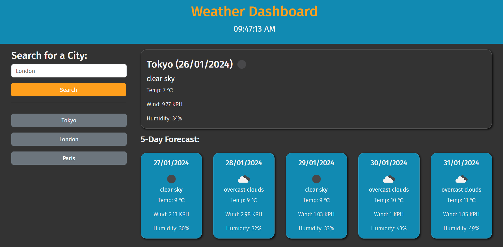
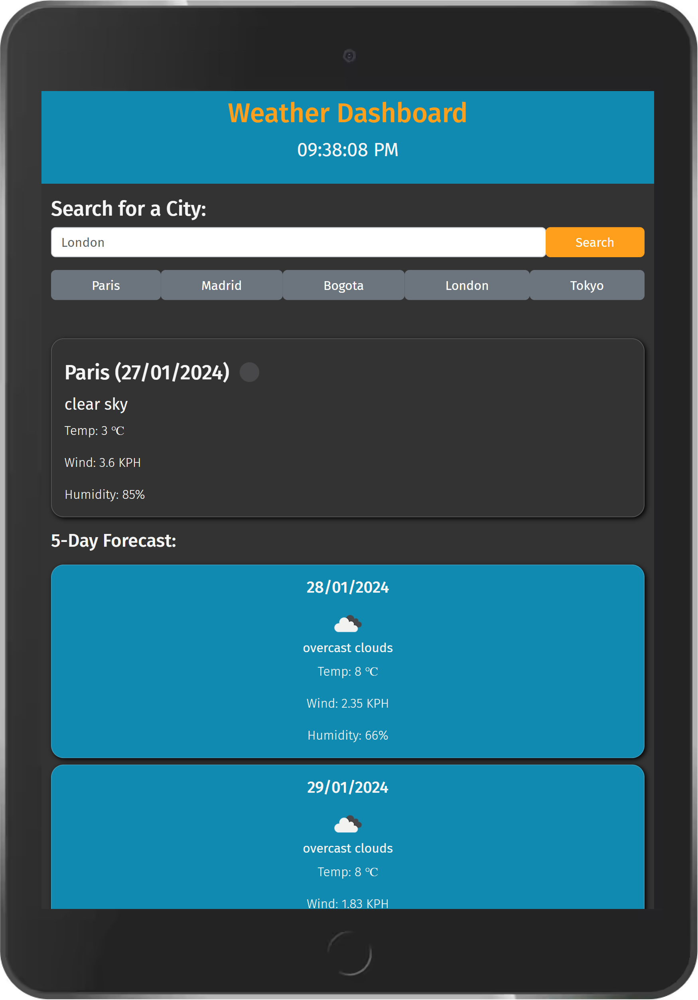
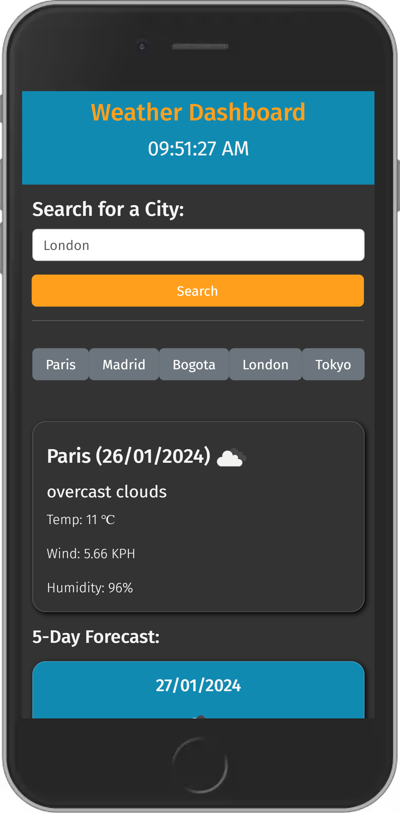

# Weather Dashboard

A Weather Dashboard where you can view the local weather conditions of searched cities.

[**Deployed Site**](https://sebzg.github.io/Weather-Dashboard/)

##

### Usage

- Simply enter city name and press "Enter" or click on "Search" button.
- Search history is saved to local storage (upto 7 cities).
- Clicking on searched history will load that cities forecast.

##

### Technologies/ Languages

- HTML
- CSS
- jQuery
- Day.js
- Bootstrap

##

### Resources

- [**Open Weather Map API**](https://openweathermap.org/)
- [**jQuery**](https://jquery.com/)
- [**Day.js**](https://day.js.org/)
- [**Bootstrap**](https://getbootstrap.com/)
- [**MDN Web Docs**](https://developer.mozilla.org/)
- [**W3 School**](https://www.w3schools.com/)

##

### Desktop View

##

### Tablet View

##

### Mobile View

